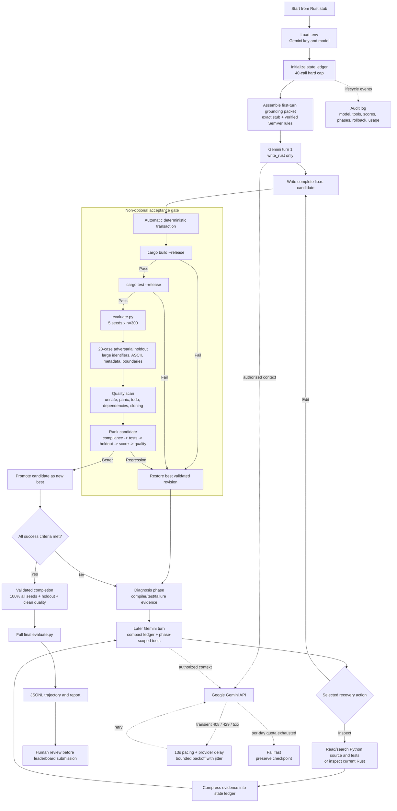

# Agent Architecture

## At a glance

The agent is a single-model translation loop wrapped in a deterministic safety
harness. Its first call receives the exact Rust stub, a compact verified SemVer
packet, and only the full-file write tool; source inspection opens afterward if
validation exposes a problem. The harness builds, tests, evaluates, and
quality-checks every edit, keeps only the best revision, and rolls back
regressions. Provider pacing and bounded retries absorb transient failures,
while explicit stop conditions, a 40-call ceiling, and JSONL logs keep the
process bounded and auditable.

The agent uses a stochastic model for source-grounded code edits and a
deterministic harness for every acceptance decision. Predictable operations are
implemented in code rather than delegated to the model.

## Design decisions

- **Deterministic acceptance:** Every Rust edit automatically triggers a release
  build, Rust tests, differential evaluation, adversarial checks, quality checks,
  and best-revision handling. The model cannot skip these steps.
- **Centralized orchestration:** The translation is sequential and tightly
  coupled, so one agent is used instead of adding multi-agent coordination risk.
- **Phase-scoped tools:** The first turn exposes only `write_rust`. Inspection,
  targeted replacement, and probing tools become available after validation
  produces evidence that a recovery turn needs them.
- **Front-loaded first turn:** The first call receives the exact Rust stub plus a
  compact, verified SemVer behavior packet and only the full-file write tool.
  Source inspection reopens after that attempt if validation finds a problem.
  This preserves source-grounded recovery while avoiding repeated browsing
  before the first implementation.
- **Bounded context:** Each call receives a state ledger and compact recent-action
  digest rather than the complete trajectory or repeated full-file versions.
- **Independent validation:** Five deterministic seeds at `n=300` are combined
  with a 23-case adversarial matrix covering identifier length, ASCII-only syntax,
  metadata precedence, and numeric boundaries.
- **Rule-aware ranking:** Rule compliance, passing tests, adversarial validation,
  behavioral correctness, test count, and avoidable ownership debt determine
  whether a candidate becomes the new best revision.
- **Recoverable failure:** Build failures, test failures, and evaluation
  regressions restore the best validated library instead of corrupting later work.
- **Provider resilience:** Calls are paced for the free tier. Transient 408, 429,
  network, and 5xx failures use bounded exponential backoff with jitter and honor
  provider retry delays; a per-day quota error fails immediately without wasting
  retries, while the current repository checkpoint remains intact.
- **Explicit termination:** Success requires 100% correctness on all local seeds,
  a passing precedence chain and adversarial matrix, passing Rust tests, and zero
  assignment violations. Plateau, repetition, empty turns, and budget exhaustion
  are separate stop conditions.
- **Auditable execution:** The JSONL trajectory records model metadata, token
  usage, active tools, actions, outputs, scores, state, rollback, and stop reason.

Repository source and diagnostics cross the external boundary to Gemini only
during an explicitly authorized agent run. Leaderboard submission remains a
separate human-approved action.
